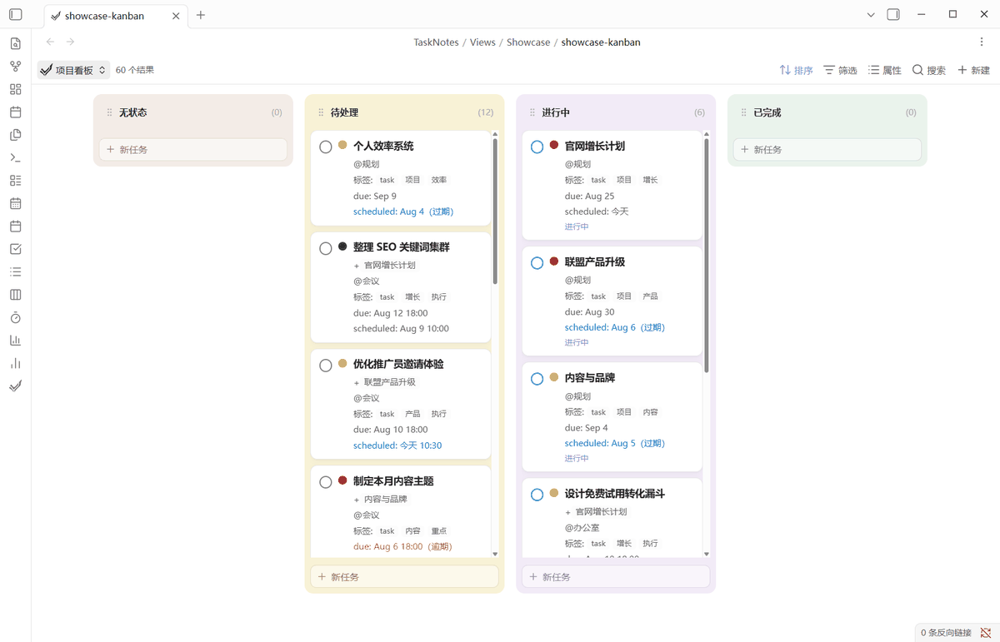
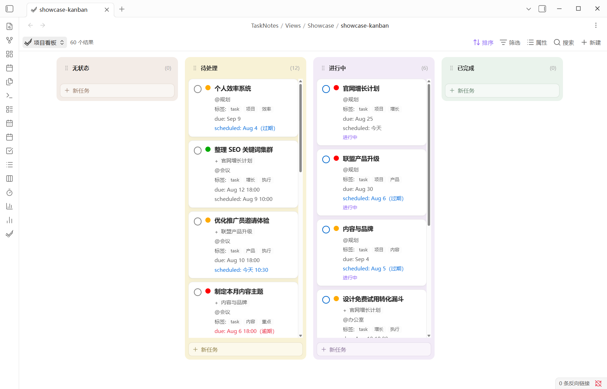
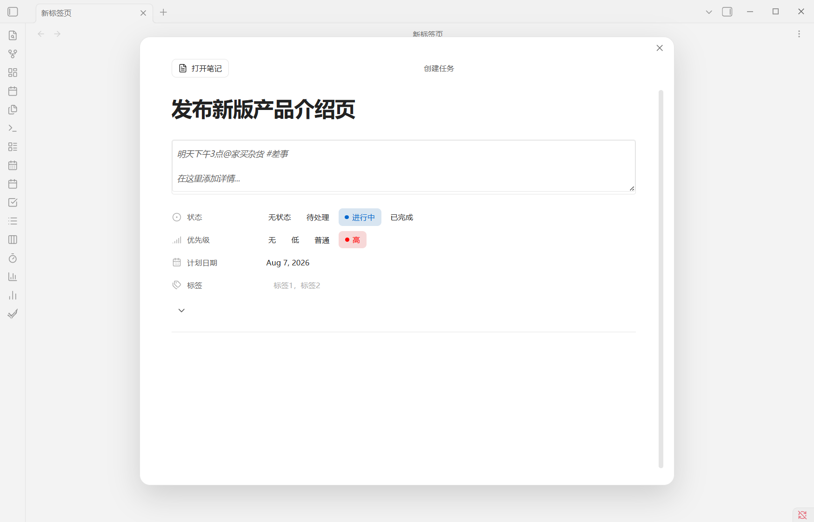
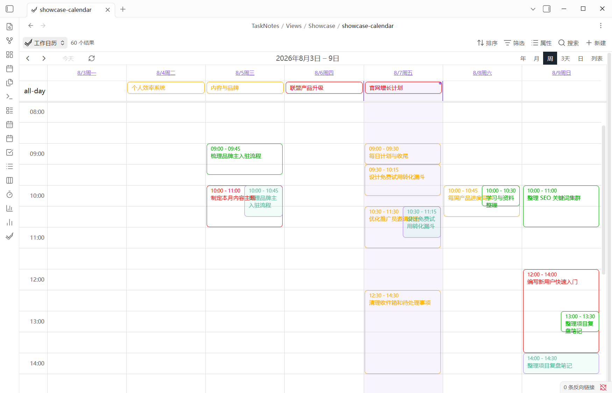
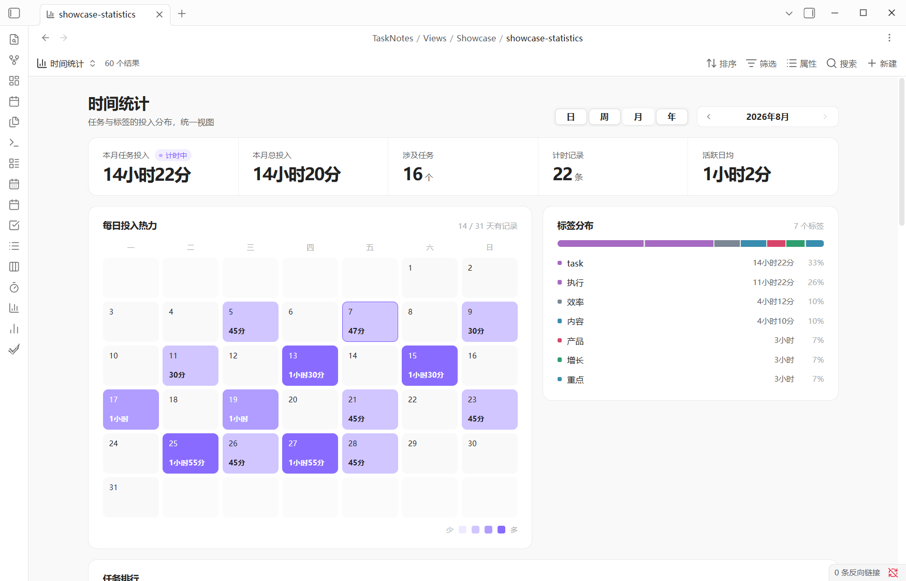

# TASKquence for Obsidian

[中文](#中文介绍) · [English](#english)

> Plan tasks with calendars, Kanban, Pomodoro, time tracking, and TASKquence iOS life-event sync.



## 中文介绍

TASKquence 是一个由 **zhuxiaocong** 独立维护的 TaskNotes 分支。它把任务规划、日历、番茄钟、时间追踪、可视化复盘与 TASKquence iOS 生活事件同步整合进 Obsidian，同时继续把每个任务保存为你仓库里的普通 Markdown 笔记。

本分支使用独立的 `taskquence` 插件 ID 和 `.obsidian/plugins/taskquence/` 安装目录。为兼容已有任务仓库，仍保留 `TaskNotes/` 数据目录和原有任务字段。

### 这一版的重点

- **自动保存的任务面板**：打开创建窗口时立即生成任务，标题、详情、属性、关系与子任务持续自动保存；支持从自然语言快速填充内容，包括“明天下午三点”一类中文日期。
- **重新设计的 Kanban**：柔和彩色列、独立任务卡、可折叠且可排序的泳道、搜索和日期筛选、卡片内快速改期，以及继承当前列与泳道属性的新建任务。
- **任务状态与计时联动**：进入“进行中”可自动开始计时，离开时停止；可拖动的悬浮控件始终提供停止和完成操作，任务笔记中的操作卡也保持一致。
- **统一时间统计**：按日、周、月、年查看时间线、月度热力图、标签分布、完整任务排行和逐条时间记录，并避免重复计算重叠计时。
- **完整计划工具**：任务列表、日程、日/周/月/年日历、重复任务、提醒、依赖关系、番茄钟，以及 Google、Microsoft 和 ICS 日历能力。
- **TASKquence iOS 同步**：将 Obsidian 中的任务规划与 TASKquence iOS 生活事件连接起来，同时以本地 Markdown 仓库作为任务数据源。
- **可配置且可迁移**：状态、优先级、属性名、自定义字段和 Base 视图都可以调整；没有单独的专有任务数据库。

### 功能预览

| 看板规划                                            | 自动保存任务                                                               |
| --------------------------------------------------- | -------------------------------------------------------------------------- |
|  |  |

| 日历计划                                                | 时间统计                                                         |
| ------------------------------------------------------- | ---------------------------------------------------------------- |
|  |  |

### 快速开始

1. 在 Obsidian 中启用核心插件 **Bases（数据库）**。
2. 安装并启用 TASKquence。首次启用会在 `TaskNotes/` 中生成中文和英文两份入门笔记，并按当前界面语言打开对应版本。
3. 打开命令面板，运行 **TASKquence: 创建新任务**，例如输入 `明天下午3点@家买杂货 #差事`。
4. 运行 **TASKquence: 打开任务视图**、**打开看板**、**打开日历**或**打开时间统计**开始规划与复盘。

默认 `.base` 文件位于 `TaskNotes/Views/`，可以像普通 Base 一样编辑、复制或嵌入任何笔记。

### 任务仍然是 Markdown

```yaml
---
title: 发布新版产品介绍页
status: in-progress
priority: high
scheduled: 2026-08-09T12:00
due: 2026-08-10T18:00
contexts: [电脑]
projects: ["[[内容与品牌]]"]
timeEstimate: 120
tags: [task, 内容, 执行]
---
```

这些属性可以直接用于 Obsidian Bases 的筛选、排序、分组和公式。你也可以加入 `energy`、`client`、`area` 等自己的字段。

### 安装

从本仓库的 [GitHub Releases](https://github.com/zczs520/tasknotes/releases) 下载发布文件，将 `main.js`、`manifest.json` 和 `styles.css` 放入仓库的 `.obsidian/plugins/taskquence/` 目录，然后在 Obsidian 的第三方插件设置中启用 TASKquence。

升级前建议备份仓库和插件数据。隐私说明见 [PRIVACY.md](PRIVACY.md)。

从旧版 Dayquence 升级时，请先停用旧的 `tasknotes` 插件，再将其 `data.json` 复制到 `.obsidian/plugins/taskquence/` 以保留设置。不要同时启用两个版本；任务笔记仍保存在原来的 `TaskNotes/` 目录中。

## English

TASKquence is an independent TaskNotes fork maintained by **zhuxiaocong**. It brings task planning, calendars, Pomodoro, time tracking, visual reviews, and TASKquence iOS life-event sync into Obsidian while keeping every task as a normal Markdown note in your vault.

The fork uses the independent `taskquence` plugin ID and `.obsidian/plugins/taskquence/` install directory. It retains the `TaskNotes/` data folder and existing task fields for vault compatibility.

### What's different in this version

- **Autosaving task sheet:** a task is created as soon as the sheet opens, and title, details, properties, relationships, and subtasks save continuously. Natural-language capture includes Chinese phrases such as “明天下午三点.”
- **Redesigned Kanban:** soft color-coded columns, standalone cards, collapsible reorderable swimlanes, search and date filters, quick rescheduling, and task creation that inherits the active column and swimlane.
- **Status-aware tracking:** entering the configured in-progress status can start timing and leaving it stops timing. A draggable floating control and task-note action card provide consistent Stop and Complete actions.
- **Unified time statistics:** day, week, month, and year timelines, heatmaps, tag distribution, complete task rankings, and individual entries, with overlapping timers counted only once in totals.
- **Planning toolkit:** task lists, agenda, day/week/month/year calendars, recurring tasks, reminders, dependencies, Pomodoro, plus Google, Microsoft, and ICS calendar capabilities.
- **TASKquence iOS sync:** connect Obsidian task planning with TASKquence iOS life events while keeping the local Markdown vault as the task source of truth.
- **Portable by design:** customize statuses, priorities, property names, user-defined fields, and Bases views without moving data into a proprietary task database.

### Quick start

1. Enable Obsidian's **Bases** core plugin.
2. Install and enable TASKquence. On first launch it creates both Chinese and English guides in `TaskNotes/` and opens the one matching the current interface language.
3. Run **TASKquence: Create new task** from the command palette and try `Review the launch plan tomorrow at 3pm @office #planning`.
4. Open the task list, Kanban, calendar, or time statistics commands to plan and review your work.

The default `.base` files live in `TaskNotes/Views/`. Edit, duplicate, or embed them like any other Obsidian Base.

### Installation

Download the release files from [GitHub Releases](https://github.com/zczs520/tasknotes/releases), copy `main.js`, `manifest.json`, and `styles.css` into `.obsidian/plugins/taskquence/`, and enable TASKquence under Obsidian's community plugin settings.

Back up your vault and plugin data before upgrading. See [PRIVACY.md](PRIVACY.md) for the privacy policy.

When upgrading from the previous Dayquence build, disable the old `tasknotes` plugin first, then copy its `data.json` into `.obsidian/plugins/taskquence/` to retain your settings. Do not enable both versions at once. Task notes remain in the existing `TaskNotes/` folder.

## Credits and license

TASKquence is based on the open-source TaskNotes project by Callum Alpass and its contributors. Calendar components are provided by [FullCalendar](https://fullcalendar.io/).

Licensed under the [MIT License](LICENSE).
