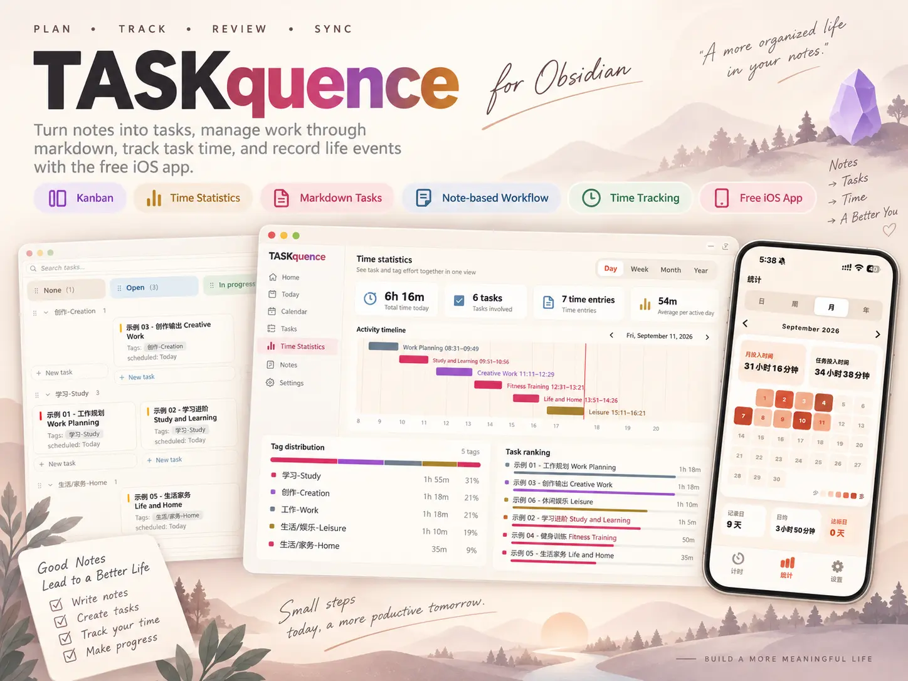
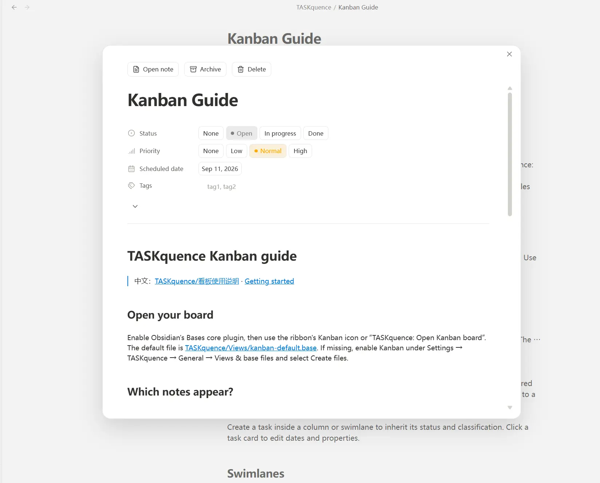
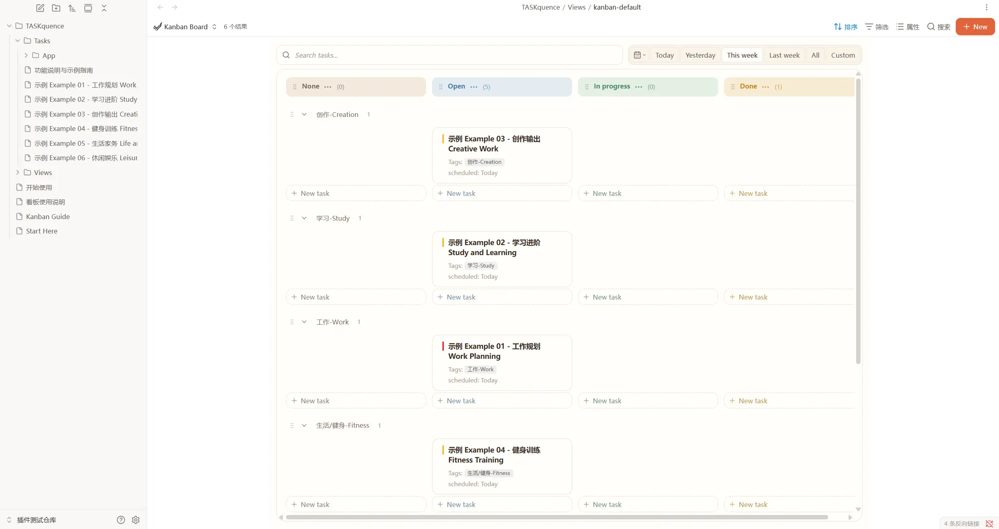
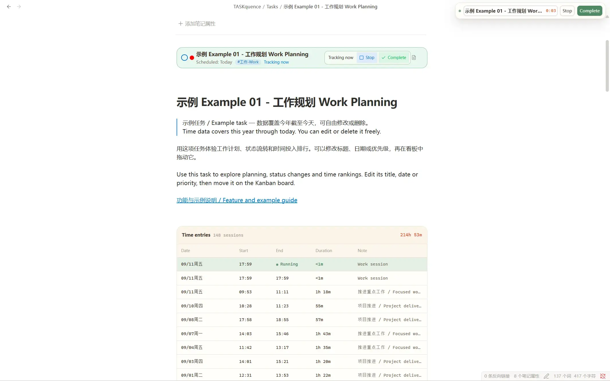
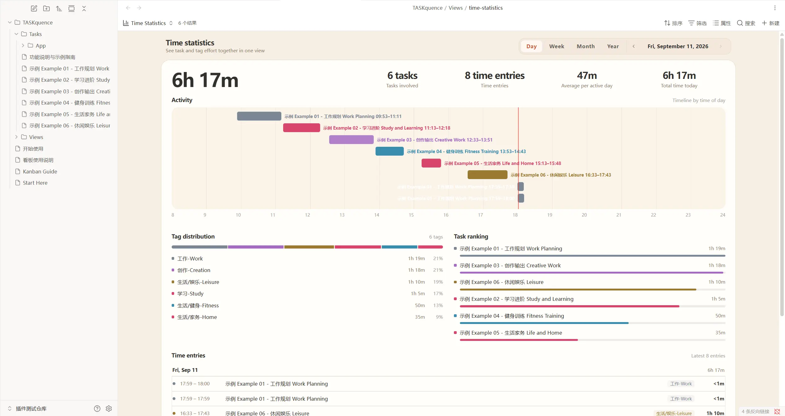
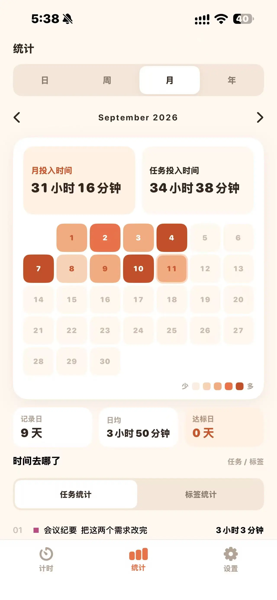

# TASKquence



TASKquence 是一款面向 Obsidian 的任务管理与时间记录插件。

它将任务规划、看板管理、时间追踪和统计复盘整合到 Obsidian 中。每一个任务仍然是知识库里的普通 Markdown 笔记，你可以自由查看、编辑、搜索、关联和备份。

TASKquence 还提供配套的 iOS App，在手机端记录日常事项与生活事件，更完整地了解自己的时间都花在了哪里。

---

## 为什么使用 TASKquence？

普通的待办事项只能告诉你“还有什么没做”。

TASKquence 希望进一步回答这些问题：

- 我今天把时间花在了什么事情上？
- 一个任务实际花了多长时间？
- 最近一周、一个月和一年，我主要在关注什么？
- 哪些任务一直被推迟？
- 我的计划时间和实际投入是否一致？
- 工作、学习、创作、运动和生活分别占用了多少时间？

TASKquence 把“任务管理”和“时间记录”放在同一套系统中，让你不只是完成任务，也能通过真实记录持续了解自己的生活。

---

## 核心功能

### 1. 任务笔记



在 TASKquence 中，每个任务都是一篇普通的 Markdown 笔记。

你可以：

- 设置状态、优先级、日期、标签和项目
- 记录任务的预计用时与实际用时

### 2. 看板视图



TASKquence 提供类似 Notion 的看板，让你通过拖放快速管理任务。

看板支持：

- 按状态和标签整理任务
- 通过拖放快速调整任务状态
- 支持搜索、日期筛选和自定义看板样式

### 3. 时间追踪



你可以从任务卡片或任务笔记中开始计时。

- 记录每项任务的实际投入时间
- 为每段时间添加说明
- 将任务状态与计时联动

TASKquence 记录的不只是任务是否完成，也记录完成任务所付出的真实时间。

### 4. 时间统计



TASKquence 提供日、周、月、年多个维度的时间统计。

- 通过时间轴查看每天做过的事情
- 按标签和项目分析时间分布
- 查看任务用时排行与长期趋势

你可以使用“工作、学习、创作、运动、生活”等标签，逐渐建立自己的生活时间账本。

### 5. iOS 配套使用

<p align="center">
  
</p>

TASKquence 提供配套的 iOS App，方便你离开电脑后继续记录。

- 在 iPhone 上创建日常事项和生活事件
- 随时记录一段活动的开始、结束与用时
- 配合 Obsidian 同步服务在不同设备间使用

仅安装 Obsidian 插件和 iOS App 不会自动连接知识库。请按照 iOS App 内的接入说明完成配置，并先使用测试任务确认同步正常。

在 App Store 搜索 `TASKquence` 即可下载使用。

### 6. 安装方法

#### 方法一：从 Obsidian 插件市场安装

这是最简单、最推荐的安装方式。

1. 打开 Obsidian。
2. 进入“设置 → 第三方插件”。
3. 关闭安全模式，并打开社区插件市场。
4. 搜索 `TASKquence`。
5. 点击“安装”，然后启用插件。

安装完成后，建议同时确认 Obsidian 的 Bases（数据库）核心插件已经启用。

---

#### 方法二：从 GitHub Releases 安装

如果无法通过插件市场安装，也可以手动下载插件文件。

1. 打开 [GitHub Releases](https://github.com/zczs520/tasknotes/releases)。
2. 下载以下三个文件：

```text
main.js
manifest.json
styles.css
```

3. 在 Obsidian 知识库中创建插件目录：

```text
.obsidian/plugins/taskquence
```

4. 将三个文件复制到该目录。
5. 重新启动 Obsidian。
6. 进入“设置 → 第三方插件”，启用 TASKquence。

## 项目来源

TASKquence 基于开源项目 [TaskNotes](https://github.com/callumalpass/tasknotes) 开发，并在此基础上加入了独立的产品设计与功能改进。

TASKquence 主要强化了：

- 更符合中文用户习惯的任务创建方式
- 重新设计的看板与时间统计
- Obsidian 与 TASKquence iOS 的配套使用

## 问题反馈

如果你遇到问题或有功能建议，可以前往：

[GitHub Issues](https://github.com/zczs520/tasknotes/issues)

提交问题时，建议提供 Obsidian 版本、TASKquence 版本、复现步骤和相关截图。

---

## 开源许可

TASKquence 使用 [MIT License](LICENSE) 开源。

你可以在遵守许可证要求的前提下使用、修改和分发本项目。
