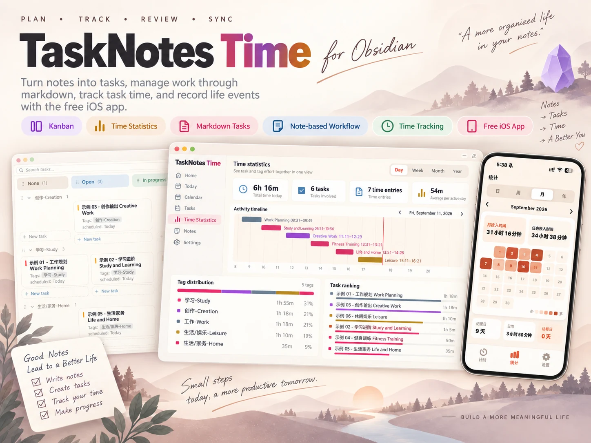
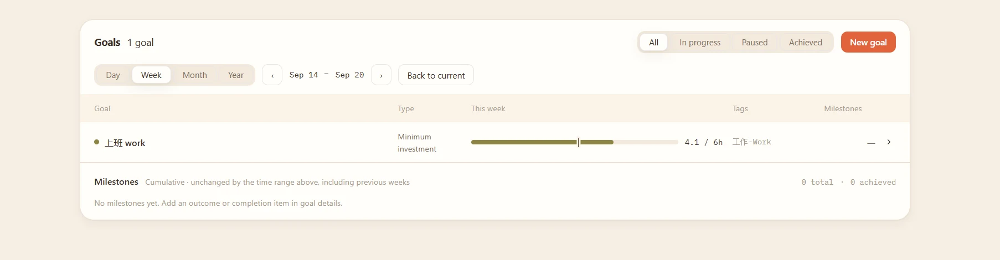

# TaskNotes Time

[中文](#中文) · [English](#english) · [Documentation](https://tasknotes.dev/)

## 中文

TaskNotes Time 是一款面向 Obsidian 的目标、任务与时间管理插件。

它将目标管理、任务规划、看板管理、时间追踪与统计复盘整合在 Obsidian 中。每一个任务仍然是知识库里的普通 Markdown 笔记，你可以自由查看、编辑、搜索、关联和备份。

TaskNotes Time 还提供配套的 iOS App，方便你在手机端记录日常事项与生活事件，更完整地了解自己的时间都花在了哪里。

---

### 为什么使用 TaskNotes Time？

普通的待办清单只能告诉你“还有什么没做”，却很难回答这些更重要的问题：

- 我现在真正重要的目标是什么？
- 当前任务是否正在推动这些目标？
- 我今天把时间花在了哪里？
- 时间投入是否与目标优先级一致？
- 一个目标已经投入了多少时间，又取得了多少进展？

TaskNotes Time 将目标、任务和时间记录连接在同一套系统中。你可以从目标出发规划里程碑和任务，在执行过程中记录真实投入，并通过统计复盘时间分配，让每天完成的事情持续推动长期目标。

---

### 核心功能

#### 1. 目标管理

将长期目标拆解为清晰、可执行的里程碑，并通过标签把任务与目标关联起来。TaskNotes Time 会汇总每个目标下的时间投入，帮助你判断自己的时间是否真正聚焦在重要方向上。

- 创建目标与阶段性里程碑
- 通过标签关联目标与任务
- 统计每个目标的累计投入时间
- 对比目标优先级与实际时间分配
- 通过任务进展持续复盘目标

#### 2. 任务笔记

在 TaskNotes Time 中，每个任务都是一篇普通的 Markdown 笔记。

- 设置状态、优先级、日期、标签和项目
- 记录任务的预计用时与实际用时
- 任务数据始终清晰、可迁移地保存在自己的知识库中

#### 3. 看板视图

TaskNotes Time 提供类似 Notion 的看板，让你通过拖放快速管理任务。

- 按状态和标签泳道整理任务
- 通过拖放快速调整任务状态
- 支持搜索、日期筛选和自定义看板样式

#### 4. 时间追踪

你可以从任务卡片或任务笔记中开始计时。

- 记录每项任务的实际投入时间
- 为每段时间添加说明
- 将任务状态与计时联动

TaskNotes Time 记录的不只是任务是否完成，也记录完成任务所付出的真实时间。

#### 5. 时间统计

TaskNotes Time 提供日、周、月、年多个维度的时间统计。

- 通过时间轴查看每天做过的事情
- 按目标、标签和项目分析时间分布
- 查看任务用时排行与长期趋势

你可以使用“工作、学习、创作、运动、生活”等标签，逐渐建立自己的生活时间账本。

#### 6. iOS 配套使用

  

TaskNotes Time 提供配套的 iOS App，方便你离开电脑后继续记录。

- 在 iPhone 上创建日常事项和生活事件
- 随时记录一段活动的开始、结束与用时
- 配合 Obsidian 同步服务在不同设备间使用

仅安装 Obsidian 插件和 iOS App 不会自动连接知识库。请按照 iOS App 内的接入说明完成配置，并先使用测试任务确认同步正常。

在 App Store 搜索 `TaskNotes Time` 即可下载使用。

### 安装方法

#### 方法一：从 Obsidian 插件市场安装

这是最简单、最推荐的安装方式。

1. 打开 Obsidian。
2. 进入“设置 → 第三方插件”。
3. 打开社区插件市场并搜索 `TaskNotes Time`。
4. 点击“安装”，然后启用插件。

安装完成后，请确认 Obsidian 的 Bases（数据库）核心插件已经启用。

#### 方法二：从 GitHub Releases 安装

如果无法通过插件市场安装，也可以手动下载插件文件。

1. 打开 [GitHub Releases](https://github.com/zczs520/tasknotes/releases)。
2. 下载 `main.js`、`manifest.json` 和 `styles.css`。
3. 在 Obsidian 知识库中创建 `.obsidian/plugins/taskquence` 文件夹。
4. 将三个文件复制到该文件夹。
5. 重新启动 Obsidian，然后在“第三方插件”中启用 TaskNotes Time。

### 项目来源

TaskNotes Time 基于开源项目 [TaskNotes](https://github.com/callumalpass/tasknotes) 开发，并在此基础上加入了独立的产品设计与功能改进。

TaskNotes Time 主要强化了：

- 目标、任务与时间投入的关联和复盘
- 更符合中文用户习惯的任务创建方式
- 重新设计的看板与时间统计
- Obsidian 与 TaskNotes Time iOS App 的配套使用

### 问题反馈

如果遇到问题或有功能建议，请前往 [GitHub Issues](https://github.com/zczs520/tasknotes/issues)。提交问题时，建议提供 Obsidian 版本、TaskNotes Time 版本、复现步骤和相关截图。

### 开源许可

TaskNotes Time 使用 [MIT License](LICENSE) 开源。你可以在遵守许可证要求的前提下使用、修改和分发本项目。

---

## English

TaskNotes Time is a goal, task, and time management plugin for Obsidian.

It brings goal management, task planning, Kanban, time tracking, and visual reviews into one workflow. Every task remains a normal Markdown note in your vault, so you can freely edit, search, link, and back it up.

TaskNotes Time also offers an iOS companion app for recording everyday activities and life events away from your computer, giving you a clearer picture of where your time goes.

---

### Why TaskNotes Time?

A normal to-do list tells you what is left to do. TaskNotes Time also helps you answer:

- What goals matter most right now?
- Are my current tasks moving those goals forward?
- Where did my time go today?
- Does my actual time investment match my priorities?
- How much time and progress has each goal accumulated?

TaskNotes Time connects goals, tasks, and real time records in one system. Plan milestones and tasks from your goals, record the effort behind your work, and review whether your daily activity is moving your long-term priorities forward.

---

### Core features

#### 1. Goal management

Break long-term goals into clear milestones, then connect tasks to goals with tags. TaskNotes Time brings the tracked time together so you can see whether your effort is focused on what matters.

- Create goals and milestones
- Connect goals and tasks through tags
- Measure cumulative time invested in each goal
- Compare goal priorities with actual time allocation
- Review progress through completed tasks and milestones

#### 2. Markdown task notes

Every task in TaskNotes Time is a normal Markdown note.

- Set status, priority, dates, tags, and projects
- Track estimated and actual time
- Keep task data readable and portable inside your own vault

#### 3. Kanban board

Manage tasks visually with a Notion-style Kanban experience.

- Organize tasks by status and tag swimlanes
- Drag cards to update task status
- Search, filter by date, and customize board appearance

#### 4. Time tracking

Start tracking from a task card or task note.

- Record the actual time spent on each task
- Add a description to every time entry
- Link task status changes with time tracking

TaskNotes Time records not only whether a task was completed, but also the real effort behind it.

#### 5. Time statistics

Review your time by day, week, month, or year.

- See daily activities on a timeline
- Analyze time by goal, tag, and project
- Review task rankings and long-term trends

Use tags such as work, study, creativity, exercise, and life to build your own personal time ledger.

#### 6. iOS companion

  

The TaskNotes Time iOS app helps you continue recording when you are away from your computer.

- Create everyday activities and life events on iPhone
- Record when an activity starts, ends, and how long it lasts
- Use your Obsidian sync service across devices

Installing the Obsidian plugin and iOS app alone does not automatically connect your vault. Follow the connection instructions in the iOS app and verify the setup with a test task first.

Search for `TaskNotes Time` in the App Store to download the iOS app.

### Installation

#### Option 1: Obsidian community plugins

This is the easiest and recommended installation method.

1. Open Obsidian.
2. Go to **Settings → Community plugins**.
3. Open **Browse** and search for `TaskNotes Time`.
4. Select **Install**, then enable the plugin.

Make sure the Obsidian **Bases** core plugin is also enabled.

#### Option 2: GitHub Releases

If you cannot install from the community plugin browser, install the release manually.

1. Open [GitHub Releases](https://github.com/zczs520/tasknotes/releases).
2. Download `main.js`, `manifest.json`, and `styles.css`.
3. Create `.obsidian/plugins/taskquence` inside your vault.
4. Copy the three files into that folder.
5. Restart Obsidian and enable TaskNotes Time under **Community plugins**.

### Project origin

TaskNotes Time is based on the open-source [TaskNotes](https://github.com/callumalpass/tasknotes) project and adds its own product design and feature improvements.

Its main areas of focus are:

- Connecting goals, tasks, and real time investment
- A task capture workflow designed for Chinese users
- Redesigned Kanban and time-statistics experiences
- Companion use between Obsidian and TaskNotes Time for iOS

### Feedback

Please report problems or feature suggestions through [GitHub Issues](https://github.com/zczs520/tasknotes/issues). Include your Obsidian version, TaskNotes Time version, reproduction steps, and screenshots when possible.

### License

TaskNotes Time is released under the [MIT License](LICENSE). You may use, modify, and distribute it under the terms of the license.
